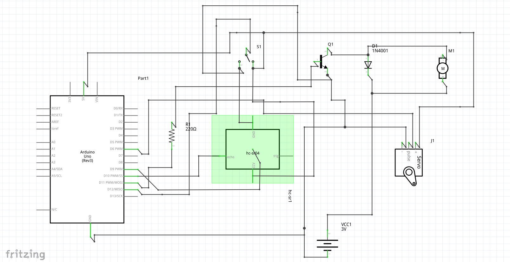
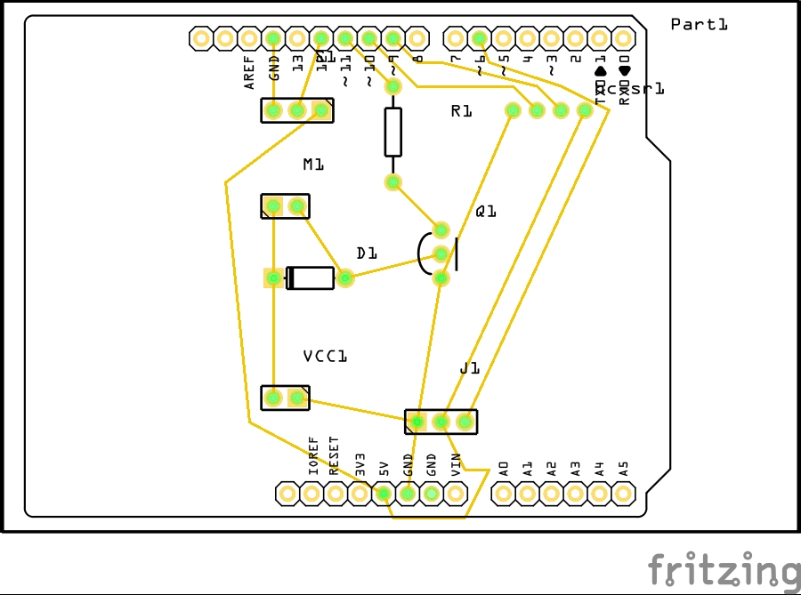
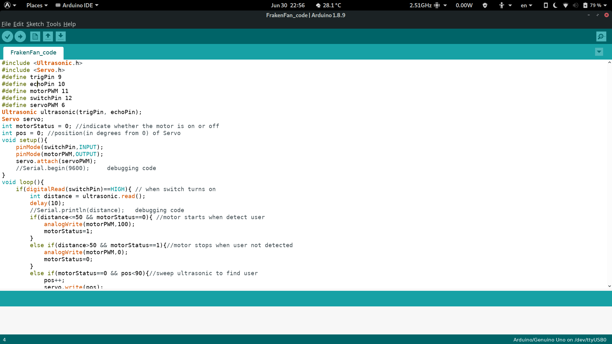
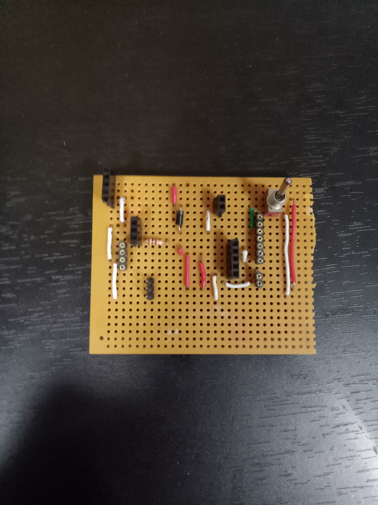
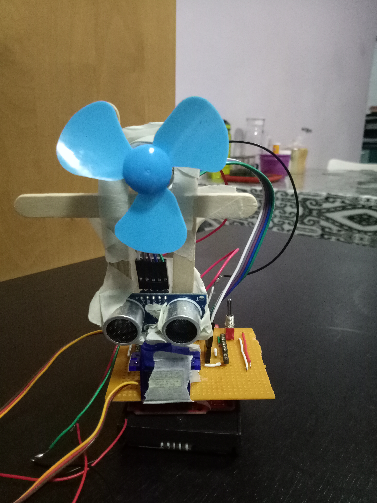
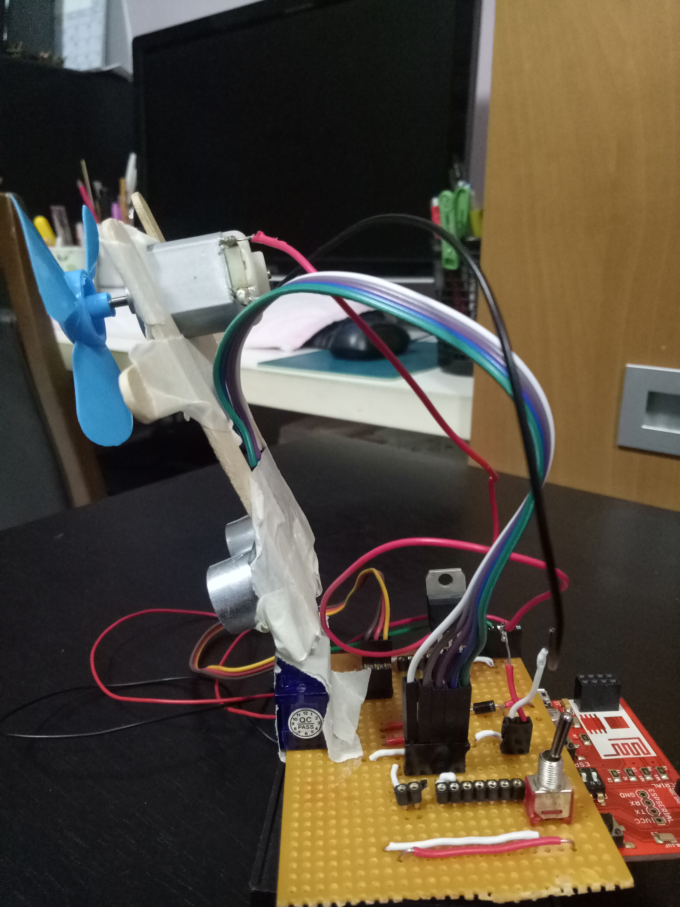
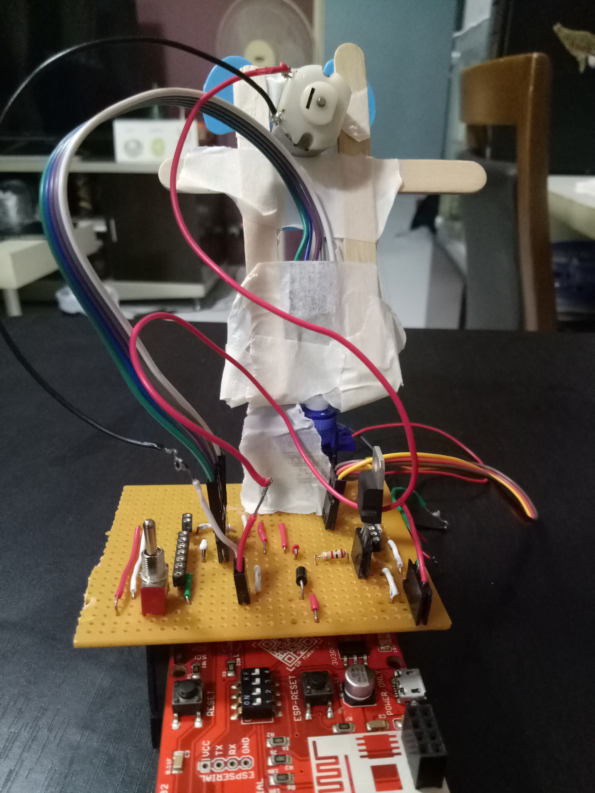

# FrakenFan
This project originates from the concept of having a fan pointing at me always regardless of my seating orientation
# Demo video
This [video](https://youtu.be/52zXk20yyTI) shows the functionality of the FrakenFan, when user is in front of the fan it turns on, else it turns off and sweeps around trying to find the user. 
# Replicating Circuit Board
To replicate the FrakenFan, the following components are required

1. Arduino Uno
2. 6V DC motor(with fan attachment)
3. SG90 Servo
4. SPDT switch
5. Ultrasonic Sensor(HC-SR04)
6. NPN transistor (TIP110)
7. Resistor (2k ohms)
8. Diode (540)

The Schematic is as below

There are a few ways to fabricate the circuit board, either by using a strip board, breadboard or use board manufacturing technique such as PCB milling or PCB etching. Do note that you might have to get additional components such as pin headers or jumper wires for the previous 2 options. For the later 2 options I have included the Gerber files within the reposistory.

Pre-export PCB Image

# The Code
I have also included the arduino ino file within the repository, click this link to go there. To successfully compile the code please install the servo library(https://github.com/arduino-libraries/Servo) and the Ultrasonic library(https://github.com/ErickSimoes/Ultrasonic) you can do this using the Arduino IDE library manager or do it manually

# Last Notes
To remake the FrakenFan you definitely need some kind of structure to support and stabilize it, for my case it was more of a quick fix using tape, blu tack, and ice cream sticks which kind of works but due to the instability the ultrasonic was wonky. To make it work properly however, 3d printed parts, or a cardboard construct would definitely make a huge difference in terms of accuracy
# Additional Pictures

